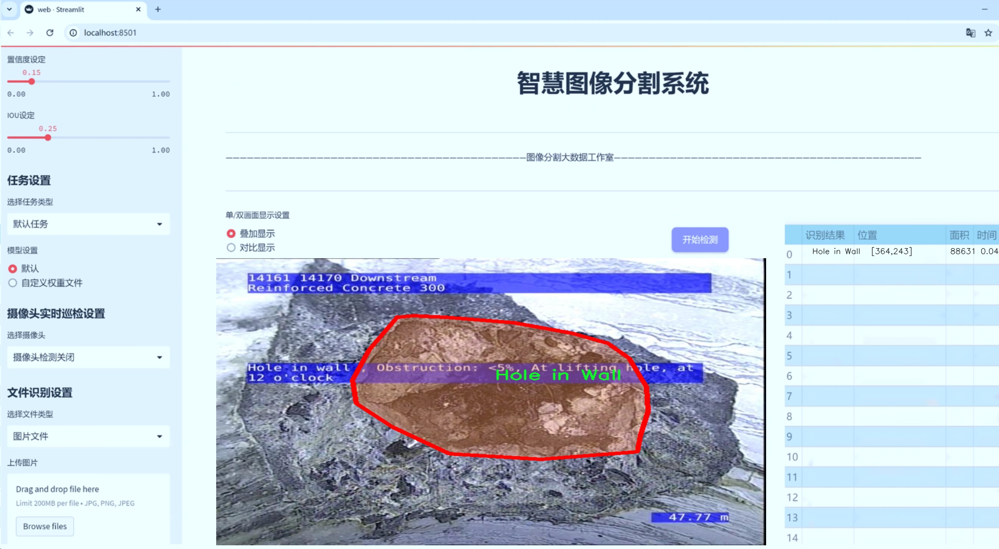

# 管道缺陷图像分割系统源码＆数据集分享
 [yolov8-seg-vanillanet＆yolov8-seg-C2f-DiverseBranchBlock等50+全套改进创新点发刊_一键训练教程_Web前端展示]

### 1.研究背景与意义

项目参考[ILSVRC ImageNet Large Scale Visual Recognition Challenge](https://gitee.com/YOLOv8_YOLOv11_Segmentation_Studio/projects)

项目来源[AAAI Global Al lnnovation Contest](https://kdocs.cn/l/cszuIiCKVNis)

研究背景与意义

随着城市化进程的加快，基础设施的维护与管理变得愈发重要，尤其是管道系统的健康状况直接影响到城市的供水、排水及整体环境的安全性。管道缺陷的及时发现与处理，不仅能够有效延长管道的使用寿命，还能减少因管道破裂或渗漏造成的经济损失和环境污染。因此，针对管道缺陷的检测与分析，尤其是图像分割技术的应用，成为了当前研究的热点之一。

近年来，深度学习技术的迅猛发展为图像处理领域带来了革命性的变化。YOLO（You Only Look Once）系列模型因其高效的实时目标检测能力而广泛应用于各类视觉任务中。YOLOv8作为该系列的最新版本，进一步提升了检测精度和速度，成为图像分割领域的重要工具。然而，传统YOLOv8模型在处理特定领域的图像分割任务时，仍存在一定的局限性，尤其是在复杂背景和多类目标的情况下。因此，基于改进YOLOv8的管道缺陷图像分割系统的研究显得尤为必要。

本研究将基于“Baseline Testing CCTV Defect”数据集，针对1300幅图像进行管道缺陷的实例分割。该数据集包含六类缺陷，包括破裂、裂缝、墙体孔洞、接缝开口、RC钢筋外露及剥落等。这些缺陷类型的多样性为模型的训练和测试提供了丰富的样本，同时也为后续的缺陷检测和分类提供了基础。通过对这些缺陷进行有效的图像分割，可以帮助工程师快速识别和定位问题，进而制定相应的维修方案。

在研究意义上，基于改进YOLOv8的管道缺陷图像分割系统不仅能够提升缺陷检测的准确性和效率，还能够为管道维护提供智能化的解决方案。通过引入先进的深度学习技术，结合具体的应用场景，研究将为传统的管道检测方法带来创新性的突破。此外，改进后的模型在实际应用中具备良好的适应性和扩展性，能够适应不同类型的管道和缺陷，为后续的研究提供了广阔的前景。

综上所述，基于改进YOLOv8的管道缺陷图像分割系统的研究，不仅具有重要的理论价值，也具备显著的实际应用意义。通过该研究，期望能够推动管道检测技术的进步，提高城市基础设施的管理水平，最终实现对城市安全和环境保护的积极贡献。

### 2.图片演示




##### 注意：由于此博客编辑较早，上面“2.图片演示”和“3.视频演示”展示的系统图片或者视频可能为老版本，新版本在老版本的基础上升级如下：（实际效果以升级的新版本为准）

  （1）适配了YOLOV8的“目标检测”模型和“实例分割”模型，通过加载相应的权重（.pt）文件即可自适应加载模型。

  （2）支持“图片识别”、“视频识别”、“摄像头实时识别”三种识别模式。

  （3）支持“图片识别”、“视频识别”、“摄像头实时识别”三种识别结果保存导出，解决手动导出（容易卡顿出现爆内存）存在的问题，识别完自动保存结果并导出到tempDir中。

  （4）支持Web前端系统中的标题、背景图等自定义修改，后面提供修改教程。

  另外本项目提供训练的数据集和训练教程,暂不提供权重文件（best.pt）,需要您按照教程进行训练后实现图片演示和Web前端界面演示的效果。

### 3.视频演示

[3.1 视频演示](https://www.bilibili.com/video/BV11eDEYFEvQ/)

### 4.数据集信息展示

##### 4.1 本项目数据集详细数据（类别数＆类别名）

nc: 6
names: ['Breaking', 'Cracking', 'Hole in Wall', 'Joint Opening', 'RC Steel Reo Exposed', 'Spalling']


##### 4.2 本项目数据集信息介绍

数据集信息展示

在本研究中，我们采用了名为“1b - Baseline Testing CCTV Defect - None augmented 2 - Additional Defects - NO CONTROL”的数据集，以训练和改进YOLOv8-seg的管道缺陷图像分割系统。该数据集专注于通过闭路电视（CCTV）监控技术识别和分类管道系统中的各种缺陷，具有重要的实际应用价值。数据集包含六个类别，分别为“Breaking”（破裂）、“Cracking”（裂缝）、“Hole in Wall”（墙体孔洞）、“Joint Opening”（接缝开口）、“RC Steel Reo Exposed”（钢筋暴露）和“Spalling”（剥落），这些类别涵盖了管道在使用过程中可能出现的主要缺陷类型。

在数据集的构建过程中，特别强调了缺陷图像的真实场景采集，确保数据的多样性和代表性。每个类别的图像均来源于实际的管道监测案例，反映了不同环境和条件下的缺陷特征。这种真实的场景数据不仅增强了模型的泛化能力，也为后续的缺陷检测和分割任务提供了坚实的基础。

数据集中的图像数量经过精心挑选，确保每个类别都有足够的样本量，以支持深度学习模型的训练。通过对这些图像进行标注，研究团队能够为YOLOv8-seg模型提供清晰的训练目标，使其能够有效地学习到各类缺陷的特征。值得注意的是，该数据集并未进行任何增强处理，这意味着模型的训练将基于原始图像数据，能够更真实地反映模型在实际应用中的表现。

在数据集的使用过程中，我们特别关注图像的质量和清晰度。高质量的图像能够提供更丰富的细节信息，有助于模型在分割任务中更准确地识别和定位缺陷。此外，数据集中每个类别的图像均包含不同角度、光照条件和背景环境的变化，这为模型的鲁棒性提供了良好的训练条件。通过这种方式，YOLOv8-seg模型能够在面对复杂的实际应用场景时，依然保持较高的检测精度。

在训练过程中，我们将数据集分为训练集和验证集，以便于对模型的性能进行评估和调整。通过对验证集的定期测试，我们能够及时发现模型在某些类别上的不足之处，并进行相应的优化。这种迭代的训练过程不仅提升了模型的整体性能，也为后续的缺陷检测系统的实际应用奠定了坚实的基础。

总之，数据集“1b - Baseline Testing CCTV Defect - None augmented 2 - Additional Defects - NO CONTROL”为本研究提供了丰富的训练素材，涵盖了管道缺陷检测的多个关键类别。通过精心设计的训练流程和模型优化策略，我们期望能够显著提升YOLOv8-seg在管道缺陷图像分割任务中的表现，为相关领域的应用提供更为可靠的技术支持。


### 5.全套项目环境部署视频教程（零基础手把手教学）

[5.1 环境部署教程链接（零基础手把手教学）](https://www.bilibili.com/video/BV1jG4Ve4E9t/?vd_source=bc9aec86d164b67a7004b996143742dc)


[5.2 安装Python虚拟环境创建和依赖库安装视频教程链接（零基础手把手教学）](https://www.bilibili.com/video/BV1nA4VeYEze/?vd_source=bc9aec86d164b67a7004b996143742dc)

### 6.手把手YOLOV8-seg训练视频教程（零基础小白有手就能学会）

[6.1 手把手YOLOV8-seg训练视频教程（零基础小白有手就能学会）](https://www.bilibili.com/video/BV1cA4VeYETe/?vd_source=bc9aec86d164b67a7004b996143742dc)


按照上面的训练视频教程链接加载项目提供的数据集，运行train.py即可开始训练



     Epoch   gpu_mem       box       obj       cls    labels  img_size
     1/200     0G   0.01576   0.01955  0.007536        22      1280: 100%|██████████| 849/849 [14:42<00:00,  1.04s/it]
               Class     Images     Labels          P          R     mAP@.5 mAP@.5:.95: 100%|██████████| 213/213 [01:14<00:00,  2.87it/s]
                 all       3395      17314      0.994      0.957      0.0957      0.0843

     Epoch   gpu_mem       box       obj       cls    labels  img_size
     2/200     0G   0.01578   0.01923  0.007006        22      1280: 100%|██████████| 849/849 [14:44<00:00,  1.04s/it]
               Class     Images     Labels          P          R     mAP@.5 mAP@.5:.95: 100%|██████████| 213/213 [01:12<00:00,  2.95it/s]
                 all       3395      17314      0.996      0.956      0.0957      0.0845

     Epoch   gpu_mem       box       obj       cls    labels  img_size
     3/200     0G   0.01561    0.0191  0.006895        27      1280: 100%|██████████| 849/849 [10:56<00:00,  1.29it/s]
               Class     Images     Labels          P          R     mAP@.5 mAP@.5:.95: 100%|███████   | 187/213 [00:52<00:00,  4.04it/s]
                 all       3395      17314      0.996      0.957      0.0957      0.0845


### 7.50+种全套YOLOV8-seg创新点代码加载调参视频教程（一键加载写好的改进模型的配置文件）

[7.1 50+种全套YOLOV8-seg创新点代码加载调参视频教程（一键加载写好的改进模型的配置文件）](https://www.bilibili.com/video/BV1Hw4VePEXv/?vd_source=bc9aec86d164b67a7004b996143742dc)

### 8.YOLOV8-seg图像分割算法原理

原始YOLOv8-seg算法原理

YOLOv8-seg算法是由Ultralytics团队在YOLOv5的基础上发展而来的一个重要版本，旨在提升目标检测和图像分割的性能。该算法于2023年1月正式提出，吸收了过去两年半内的多项技术改进，形成了一个高效、准确且易于使用的目标检测框架。YOLOv8-seg不仅继承了YOLO系列模型的优良传统，还在网络结构、训练策略和损失函数等多个方面进行了创新，显著提高了模型的性能和适用性。

在YOLOv8-seg的设计中，网络结构被划分为三个主要部分：主干网络（Backbone）、特征增强网络（Neck）和检测头（Head）。其中，主干网络的核心是C2f模块，这一模块在C3模块的基础上进行了改进，借鉴了YOLOv7中的ELAN思想，增加了更多的跳层连接。这种设计不仅增强了梯度流的丰富性，还有效地减轻了模型的计算负担，确保了轻量化的同时提高了模型的表达能力。

YOLOv8-seg在特征增强网络中采用了PAN-FPN的结构，旨在更好地融合不同层次的特征信息。通过这种方式，模型能够在多尺度特征的提取上实现更高的灵活性和准确性，尤其是在处理复杂场景时，能够有效提高目标检测的精度和召回率。此外，YOLOv8-seg还在网络的最后阶段引入了自适应图像缩放策略，以提高推理速度和检测精度。这一策略通过将输入图像的长边缩放到指定尺寸，同时对短边进行填充，最大限度地减少了信息冗余，确保了模型在不同长宽比的图像上都能保持良好的性能。

在检测头的设计上，YOLOv8-seg采用了解耦头的结构，分别处理目标的分类和定位任务。这种解耦设计使得模型能够更专注于各自的任务，从而在复杂场景下有效减少定位不准和分类错误的问题。与传统的耦合头不同，YOLOv8-seg的解耦头将输入特征图通过两个独立的卷积模块进行处理，一个用于类别预测，另一个用于边界框位置和IoU（交并比）预测。这种设计不仅提高了模型的收敛速度，还显著提升了预测的精度。

YOLOv8-seg还摒弃了传统的Anchor-based方法，转而采用Anchor-free的目标检测策略。这一策略通过将目标检测问题转化为关键点检测，避免了对锚框的预设和调整，从而简化了模型的设计。Anchor-free方法的优势在于其更强的泛化能力和更简洁的网络框架，使得模型在处理不同尺度和形状的目标时更加灵活。此外，YOLOv8-seg引入了任务对齐学习（Task Alignment Learning，TAL）机制，通过分类分数和IoU的高次幂乘积来衡量任务对齐程度，进一步提升了模型在分类和定位任务中的表现。

在训练过程中，YOLOv8-seg采取了Mosaic数据增强策略，以提高模型的鲁棒性和泛化能力。然而，针对Mosaic数据增强可能导致的真实分布破坏问题，YOLOv8-seg在训练的最后10个epoch中停止使用该增强策略，以确保模型能够更好地学习到真实数据的特征。这一策略的实施使得模型在实际应用中能够更好地适应不同的环境和场景。

在性能评估方面，YOLOv8-seg在COCO数据集上的表现尤为突出。通过对比不同尺寸的模型，YOLOv8-seg在保持较小参数量的前提下，取得了比其他YOLO系列模型更高的精度和更快的推理速度。这一成果表明，YOLOv8-seg在实时目标检测和图像分割任务中具备了良好的应用前景，尤其适合于需要快速响应和高准确率的场景，如自动驾驶、智能监控和机器人视觉等。

综上所述，YOLOv8-seg算法通过一系列创新设计和改进，成功提升了目标检测和图像分割的性能。其在网络结构、训练策略和损失函数等方面的优化，使得YOLOv8-seg不仅具备了高效的计算能力，还能够在复杂场景中保持优异的表现。随着该算法的不断发展和应用，未来在更多领域的推广和应用将成为可能，为智能视觉技术的进步提供强有力的支持。


### 9.系统功能展示（检测对象为举例，实际内容以本项目数据集为准）

图9.1.系统支持检测结果表格显示

  图9.2.系统支持置信度和IOU阈值手动调节

  图9.3.系统支持自定义加载权重文件best.pt(需要你通过步骤5中训练获得)

  图9.4.系统支持摄像头实时识别

  图9.5.系统支持图片识别

  图9.6.系统支持视频识别

  图9.7.系统支持识别结果文件自动保存

  图9.8.系统支持Excel导出检测结果数据


### 10.50+种全套YOLOV8-seg创新点原理讲解（非科班也可以轻松写刊发刊，V11版本正在科研待更新）

#### 10.1 由于篇幅限制，每个创新点的具体原理讲解就不一一展开，具体见下列网址中的创新点对应子项目的技术原理博客网址【Blog】：


[10.1 50+种全套YOLOV8-seg创新点原理讲解链接](https://gitee.com/qunmasj/good)

#### 10.2 部分改进模块原理讲解(完整的改进原理见上图和技术博客链接)【如果此小节的图加载失败可以通过CSDN或者Github搜索该博客的标题访问原始博客，原始博客图片显示正常】
### YOLOv8简介
在各种目标检测算法中，YOLO系列因其速度和准确度间的优异平衡脱颖而出，能够准确、快速的识别目标，便于部署到各种移动设备中，已经广泛应用于各种领域的目标检测、跟踪和分割。目前最新版本 YOLOv8由原v5的开发团队Ultralytics于2023年1月提出，按规格大小可划分为n、s、m、1和x5个版本，是目前最先进的目标检测算法，有着优异的性能，很适合用于无人机航拍图像目标检测。其网络结构如图所示。

YOLOv8模型包括Input、Backbone、Neck 和Head4部分。其中 Input选用了Mosaic数据增强方法，并且对于不同大小的模型，有部分超参数会进行修改，典型的如大模型会开启 MixUp 和CopyPaste数据增强，能够丰富数据集，提升模型的泛化能力和鲁棒性。Backbone主要用于提取图片中的信息，提供给Neck和Head使用，由多个Conv、C2f模块和尾部的SPPF组成。Conv模块由单个Conv2d、
BatchNorm2d和激活函数构成,用丁是双行在万E5特征图;YOLOv8参考了C3模块的残左绒以心YOLOv7[16l的ELAN思想，设计出了C2f 结构，可以在保证轻量化的同时获得更加丰富的梯度流信息，并根据模型尺度来调整通道数，大幅提升了模型性能;SPPF是空间金字塔池化，能够融合不同尺度的特征。Neck部分主要起特征融合的作用，充分利用了骨干网络提取的特征，采用FPN[17]+PAN[18〕结构，
能够增强多个尺度上的语义表达和定位能力。Head输出端根据前两部分处理得到的特征来获取检测目标的类别和位置信息，做出识别,换以小旦公来和定解耦头结构,将分类和检测头分:9w‘无锅框的位关注侧重点不同的问题，同时也采用了无锚框的目标检测（Anchor-Free)，能够提升检测速度。Loss计算方面采用了正负样本动态分配策略，使用 VFLLoss 作为分类损失，使用DFLLoss+CIOU Loss作为回归损失。

### AutoFocus: Efficient Multi-Scale Conv简介

参考该博客提出了AutoFocus，一种高效的多尺度目标检测算法。相较于以前对整个图像金字塔进行处理，该方法以一种由表及里的姿态，仅处理哪些整体上看来很有可能存在小物体的区域。这个可以通过预测一张类别未知的分割图FocusPixels来得到。为了高效利用FocusPixels，另外一个算法用于产生包含FocusPixels的FocusChips，这样可以减少计算量并处理更更精细的尺度。在不同尺度上FocusChips所得到的检测结果综合时，会出现问题，我们也提供了解决问题的方案。AutoFocus在COCO上的结果有49.7%mAP（50%重叠下68.3%），与多尺度baseline相仿但是快了2.5倍。金字塔中处理的像素数量减少了5倍mAP只下降1%，在与RetinaNet采用相同的ResNet-101结构且速度相同时，高了10%mAP。

人类寻找物体是一个动态的过程，且寻找时间与场景的复杂度是直接相关的。当我们的眼神在不同的点之间漂移时，其他的区域会被我们有意忽视。然而，现在的检测算法是一种静态的推理过程且图像金字塔中的每个像素都受到了一样的对待，这使得过程变得没有效率。现在许多的应用都不强调实时性，而计算上的节省其实可以产生很大收益。

在COCO数据集中，虽然40%的物体都是小物体，但是它们一共只占了全图的0.3%。如果金字塔是3倍关系，则在高分辨率层要进行9倍的运算。XXX 。那么有没有办法在低分辨率下找出可能含有这些物体的区域呢？

以人眼方案类比，我们可以从低分辨率图像开始，找出有可能存在物体的区域再“聚集”到高分辨率。我们的AutoFocus会在一层中计算小物体的分割图FocusPixels，而在每一个FocusPixels上会用一个算法产生下一层所需要关注的chips。在COCO的最大分辨率层上我们可以只处理**20%的像素而性能不下降，如果只处理5%**也只下降1%而已。


图像金字塔与卷积神经网络对CV十分重要。然而卷积神经网络无法做到对尺度不敏感，所以为了不同大小的物体需要依赖图像金字塔。虽然训练已经有了高效的方法，但是其推断时间依然远离实际使用标准。

目标检测加速有很长历史了。常用的有特征近似以减少尺度、级联、特征金字塔，且最后一个最近很多人研究。

AutoFocus为速度与精度之间提供了一个平滑的折衷，指出可以在低分辨率下看出小物体的所在，从而节约计算。FocusPixels的计算较为容易。

先简单介绍一下SNIP，是一种多尺度的训练、推断算法。主要思想是训练针对某个特定scale的检测器而不是scale-invariant检测器。这样训练样本就局限于在某个尺度范围内，以适于这个检测器处理。比如在高分辨率仅处理小物体而高分辨率仅处理大物体，其优势在于训练时不用考虑尺度的变化。

由于训练时物体大小是已知的，我们在图像金字塔中可以忽略大量区域而只处理物体周围的区域。SNIPER说明这样低分辨率的训练与全图训练相比并不会降低性能。同样，在推断过程中如果可以在大分辨率图像上预测可能出现小物体的chip，我们也就不用处理整张高分辨率图片。在训练时，许多物体会被裁剪、扭曲，这可以当作是一种数据扩增，然而当这个情况在推断时出现，则会产生错误，所以我们还需要一个算法来整合不同尺度上的检测结果。

#### AutoFocus框架
如SIFT、SURF等传统分类特征包含两个组件，一个detector和一个descriptor。detector只包含轻量级的操作如DoG、LoG，用于在整张图片上找到感兴趣的区域；descriptor，一般来说计算量比较大，则只需要关注那些咸兴趣的区域。这个级联结构保障了图片处理的效率。

同样，AutoFocus框架也是用于预测感兴趣的区域，并丢弃在下一尺度不可能存在物体的区域，并将裁剪和缩放后的区域传递给下一尺度。AutoFocus由三个部分组成：FocusPixels，FocusChips和focus stacking。

#### FocusPixels
FocusPixels定义在卷积网络特征图的粒度之上（如conv5），如果特征图上某个像素与小物体有重叠则标注为一个FocusPixel。（小物体：面积处于一个网络的输入范围之内）。训练过程中，FocusPixels标注为正，某些与不在面积范围内的物体有重叠的像素标注为无效，其他像素标注为负。AutoFocus的训练目标是使在FocusPixels区域产生较大的激活值。

如果同时多个物体与同一像素重叠，优先给正标注。我们的网络输入是512x512，然后a,b,c取值分别是5,64,90。对于太大或太小的物体，我们认为当前尺度上没有足够人信息进行判断，所以会标定为无效。整个网络结构如下图。训练时加两层带ReLU的卷积(3x3和1x1)以及一个二分类softmax来预测FocusPixels。


#### FocusChip生成
推断过程中，我们标注输出概率大于阈值t的像素（这个参数可以控制加速比），得到一些连通域。对于每一个域，我们做一次膨胀使其包含一些有助于识别的周围信息，膨胀后相连的部分要合并。然后，我们生成一些包含连通域的chips（不同chips可能重叠，如有重叠则合并）。有些chip可能太小缺少必要信息，并使chip的大小变化很大，为了效率我们要求保证一个最小的chip size。算法流程如下：


#### 级联推断过程
我们的过程类似于图片金字塔的推断过程但是在过程中一步步去除不关注的图片区域。我们在最低分辨率上进行检测并生成chips，然后在这些chips再进行检测和生成chips。

#### Focus Stacking
这种级联分类器的一个问题是在chip边缘本来的大物体可能生成一些被剪裁的检测目标。在下一个尺度上，由于剪裁过了，所以会检测到小的、错误的正例False Positive。之前算法中的第二步膨胀其实就是为了保证没有物体会出现在chip的边缘。这样，当我们在局部图片chip的边缘检测到物体时，就可以把这个检测结果丢弃，即使其在SNIP的范围内。

也有一些物体在图片边缘的特殊情况。如果chip和图片共享一条边的话，我们会检查检测结果的其他边是否完全在里面，如果在，则保留它，否则丢弃。

在每一尺度得到有效检测结果后，我们可以将不同尺度上的结果进行整合，将这些结果映射到原图坐标系上。最后，非极大值抑制NMS用于聚集。网络结构如之前的图片所示。


### 11.项目核心源码讲解（再也不用担心看不懂代码逻辑）

#### 11.1 ultralytics\models\__init__.py

以下是对提供代码的逐行分析和核心部分的保留，以及详细的中文注释：

```python
# Ultralytics YOLO 🚀, AGPL-3.0 license

# 从当前包中导入 RTDETR、SAM 和 YOLO 类
from .rtdetr import RTDETR  # 导入 RTDETR 类
from .sam import SAM        # 导入 SAM 类
from .yolo import YOLO      # 导入 YOLO 类

# 定义模块的公开接口，允许用户简单导入这些类
__all__ = 'YOLO', 'RTDETR', 'SAM'  # 公开接口，包含 YOLO、RTDETR 和 SAM
```

### 代码核心部分分析：
1. **导入模块**：
   - `from .rtdetr import RTDETR`：从当前包的 `rtdetr` 模块中导入 `RTDETR` 类。
   - `from .sam import SAM`：从当前包的 `sam` 模块中导入 `SAM` 类。
   - `from .yolo import YOLO`：从当前包的 `yolo` 模块中导入 `YOLO` 类。

2. **公开接口定义**：
   - `__all__` 是一个特殊变量，用于定义模块的公共接口。当使用 `from module import *` 时，只有在 `__all__` 中列出的名称会被导入。这里列出了 `YOLO`、`RTDETR` 和 `SAM`，表示这些类是模块的核心部分，用户可以直接使用它们。

### 总结：
这段代码的核心功能是导入三个重要的类，并定义了一个公共接口，方便用户在使用该模块时进行简化导入。

这个文件是Ultralytics YOLO项目中的一个初始化文件，位于`ultralytics/models`目录下。它的主要作用是导入和组织该模块中的类或函数，以便在其他地方可以更方便地使用。

首先，文件开头的注释部分提到这是Ultralytics YOLO项目，并且标明了其使用的AGPL-3.0许可证。这表明该项目是开源的，用户可以自由使用和修改，但需要遵循相应的许可证条款。

接下来，文件通过相对导入的方式引入了三个模型：`RTDETR`、`SAM`和`YOLO`。这些模型可能是实现目标检测或分割等功能的核心组件。通过这种方式，其他模块或文件在导入`ultralytics.models`时，可以直接使用这些模型，而不需要单独去导入每一个模型文件。

最后，`__all__`变量被定义为一个元组，包含了`'YOLO'`、`'RTDETR'`和`'SAM'`。这个变量的作用是指定当使用`from module import *`语句时，哪些名称会被导入。这种做法可以帮助控制模块的公共接口，避免不必要的名称泄露。

总体来说，这个文件的结构简单明了，主要是为了方便模型的组织和导入，使得用户在使用Ultralytics YOLO时能够更加高效地访问不同的模型。

#### 11.2 ultralytics\nn\backbone\convnextv2.py

以下是代码中最核心的部分，并附上详细的中文注释：

```python
import torch
import torch.nn as nn
import torch.nn.functional as F

class LayerNorm(nn.Module):
    """ 自定义的层归一化（Layer Normalization）类，支持两种数据格式：channels_last（默认）和 channels_first。
    channels_last 对应的输入形状为 (batch_size, height, width, channels)，
    而 channels_first 对应的输入形状为 (batch_size, channels, height, width)。
    """
    def __init__(self, normalized_shape, eps=1e-6, data_format="channels_last"):
        super().__init__()
        # 权重和偏置初始化
        self.weight = nn.Parameter(torch.ones(normalized_shape))
        self.bias = nn.Parameter(torch.zeros(normalized_shape))
        self.eps = eps
        self.data_format = data_format
        if self.data_format not in ["channels_last", "channels_first"]:
            raise NotImplementedError 
        self.normalized_shape = (normalized_shape, )
    
    def forward(self, x):
        # 根据数据格式进行归一化
        if self.data_format == "channels_last":
            return F.layer_norm(x, self.normalized_shape, self.weight, self.bias, self.eps)
        elif self.data_format == "channels_first":
            u = x.mean(1, keepdim=True)  # 计算均值
            s = (x - u).pow(2).mean(1, keepdim=True)  # 计算方差
            x = (x - u) / torch.sqrt(s + self.eps)  # 标准化
            x = self.weight[:, None, None] * x + self.bias[:, None, None]  # 应用权重和偏置
            return x

class Block(nn.Module):
    """ ConvNeXtV2 的基本模块（Block）。
    
    Args:
        dim (int): 输入通道数。
        drop_path (float): 随机深度率。默认值为 0.0。
    """
    def __init__(self, dim, drop_path=0.):
        super().__init__()
        # 深度卷积层
        self.dwconv = nn.Conv2d(dim, dim, kernel_size=7, padding=3, groups=dim)
        self.norm = LayerNorm(dim, eps=1e-6)  # 归一化层
        self.pwconv1 = nn.Linear(dim, 4 * dim)  # 1x1 卷积，使用线性层实现
        self.act = nn.GELU()  # 激活函数
        self.pwconv2 = nn.Linear(4 * dim, dim)  # 另一个 1x1 卷积
        self.drop_path = nn.Identity() if drop_path <= 0. else DropPath(drop_path)  # 随机深度

    def forward(self, x):
        input = x  # 保存输入以便后续残差连接
        x = self.dwconv(x)  # 深度卷积
        x = x.permute(0, 2, 3, 1)  # 调整维度顺序
        x = self.norm(x)  # 归一化
        x = self.pwconv1(x)  # 1x1 卷积
        x = self.act(x)  # 激活
        x = self.pwconv2(x)  # 另一个 1x1 卷积
        x = x.permute(0, 3, 1, 2)  # 恢复维度顺序

        x = input + self.drop_path(x)  # 残差连接
        return x

class ConvNeXtV2(nn.Module):
    """ ConvNeXt V2 模型定义。
    
    Args:
        in_chans (int): 输入图像的通道数。默认值为 3。
        num_classes (int): 分类头的类别数。默认值为 1000。
        depths (tuple(int)): 每个阶段的块数。默认值为 [3, 3, 9, 3]。
        dims (int): 每个阶段的特征维度。默认值为 [96, 192, 384, 768]。
        drop_path_rate (float): 随机深度率。默认值为 0。
    """
    def __init__(self, in_chans=3, num_classes=1000, 
                 depths=[3, 3, 9, 3], dims=[96, 192, 384, 768], 
                 drop_path_rate=0.):
        super().__init__()
        self.depths = depths
        self.downsample_layers = nn.ModuleList()  # 存储下采样层
        # 定义初始卷积层
        stem = nn.Sequential(
            nn.Conv2d(in_chans, dims[0], kernel_size=4, stride=4),
            LayerNorm(dims[0], eps=1e-6, data_format="channels_first")
        )
        self.downsample_layers.append(stem)
        # 定义后续的下采样层
        for i in range(3):
            downsample_layer = nn.Sequential(
                    LayerNorm(dims[i], eps=1e-6, data_format="channels_first"),
                    nn.Conv2d(dims[i], dims[i+1], kernel_size=2, stride=2),
            )
            self.downsample_layers.append(downsample_layer)

        self.stages = nn.ModuleList()  # 存储特征分辨率阶段
        dp_rates = [x.item() for x in torch.linspace(0, drop_path_rate, sum(depths))] 
        cur = 0
        # 定义每个阶段的残差块
        for i in range(4):
            stage = nn.Sequential(
                *[Block(dim=dims[i], drop_path=dp_rates[cur + j]) for j in range(depths[i])]
            )
            self.stages.append(stage)
            cur += depths[i]

        self.norm = nn.LayerNorm(dims[-1], eps=1e-6)  # 最后的归一化层
        self.head = nn.Linear(dims[-1], num_classes)  # 分类头

    def forward(self, x):
        res = []  # 存储每个阶段的输出
        for i in range(4):
            x = self.downsample_layers[i](x)  # 下采样
            x = self.stages[i](x)  # 残差块处理
            res.append(x)  # 保存输出
        return res  # 返回每个阶段的输出
```

### 代码核心部分说明：
1. **LayerNorm**: 自定义的层归一化模块，支持不同的输入格式。
2. **Block**: ConvNeXtV2的基本构建块，包含深度卷积、归一化、激活和残差连接。
3. **ConvNeXtV2**: 主模型类，定义了网络的结构，包括下采样层和多个阶段的残差块。

这个程序文件实现了ConvNeXt V2模型的构建，主要用于计算机视觉任务。文件中包含了多个类和函数，每个部分都有其特定的功能。

首先，文件引入了必要的库，包括PyTorch和一些辅助函数。接着，定义了一个`LayerNorm`类，它实现了层归一化功能，支持两种数据格式：`channels_last`和`channels_first`。在`forward`方法中，根据输入数据的格式，使用不同的方式进行归一化处理。

接下来，定义了一个`GRN`类，表示全局响应归一化层。该层通过计算输入的L2范数，并根据均值进行归一化，最后结合可学习的参数`gamma`和`beta`进行输出。

然后，定义了`Block`类，表示ConvNeXt V2的基本构建块。这个块包括深度卷积、层归一化、点卷积、激活函数（GELU）和全局响应归一化。通过这些操作，模型能够提取更丰富的特征。`drop_path`是一个随机深度的机制，用于在训练过程中随机丢弃某些路径，以增强模型的泛化能力。

`ConvNeXtV2`类是整个模型的核心。它接受输入通道数、分类头的类别数、每个阶段的块数、特征维度等参数。在初始化时，构建了下采样层和多个特征分辨率阶段，每个阶段由多个残差块组成。模型的最后一层是一个线性层，用于分类。

此外，文件中还定义了一个`update_weight`函数，用于更新模型的权重。这个函数会检查模型字典和权重字典中的键是否匹配，并且形状是否一致，然后更新模型的权重。

最后，文件提供了多个函数（如`convnextv2_atto`、`convnextv2_femto`等），这些函数用于创建不同规模的ConvNeXt V2模型，并可选择加载预训练权重。每个函数都指定了不同的深度和特征维度，以适应不同的应用需求。

总体而言，这个文件实现了一个灵活且可扩展的卷积神经网络架构，适用于各种计算机视觉任务。

#### 11.3 ultralytics\nn\extra_modules\ops_dcnv3\modules\__init__.py

以下是保留的核心代码部分，并附上详细的中文注释：

```python
# 导入必要的模块
from .dcnv3 import DCNv3, DCNv3_pytorch, DCNv3_DyHead

# 以上代码从当前包（.）中导入了三个类或函数：
# 1. DCNv3：可能是一个深度可分离卷积网络的实现。
# 2. DCNv3_pytorch：可能是针对PyTorch框架的DCNv3实现。
# 3. DCNv3_DyHead：可能是一个动态头部的实现，用于特定的任务或模型。
```

在这个代码片段中，主要的功能是导入自定义模块中的类或函数，以便在当前模块中使用。这些类或函数可能与深度学习中的卷积神经网络相关。

这个程序文件是一个Python模块的初始化文件，位于`ultralytics/nn/extra_modules/ops_dcnv3/modules/`目录下。文件的开头部分包含了一些版权信息，表明该代码属于OpenGVLab，并且受MIT许可证的保护，这意味着用户可以自由使用、修改和分发该代码，只要遵循许可证的条款。

接下来的代码是导入语句，具体导入了三个类或函数：`DCNv3`、`DCNv3_pytorch`和`DCNv3_DyHead`。这些名称表明它们可能与深度学习中的某种卷积操作有关，尤其是与动态卷积（Dynamic Convolution）相关的实现。

通过这种方式，其他模块在导入这个包时，可以直接使用这些类或函数，而不需要知道它们具体定义的位置。这种做法有助于提高代码的可读性和模块化，使得开发者能够更方便地使用和维护代码。

#### 11.4 ultralytics\models\yolo\detect\train.py

以下是经过简化并注释的核心代码部分，主要关注于YOLO目标检测模型的训练过程：

```python
# 导入必要的库
from copy import copy
import numpy as np
from ultralytics.data import build_dataloader, build_yolo_dataset
from ultralytics.engine.trainer import BaseTrainer
from ultralytics.models import yolo
from ultralytics.nn.tasks import DetectionModel
from ultralytics.utils import LOGGER, RANK
from ultralytics.utils.torch_utils import de_parallel, torch_distributed_zero_first

class DetectionTrainer(BaseTrainer):
    """
    继承自BaseTrainer类，用于基于检测模型的训练。
    """

    def build_dataset(self, img_path, mode='train', batch=None):
        """
        构建YOLO数据集。

        参数:
            img_path (str): 包含图像的文件夹路径。
            mode (str): 模式，'train'或'val'，用于自定义不同的增强方式。
            batch (int, optional): 批次大小，仅在'rect'模式下使用，默认为None。
        """
        gs = max(int(de_parallel(self.model).stride.max() if self.model else 0), 32)  # 获取模型的最大步幅
        return build_yolo_dataset(self.args, img_path, batch, self.data, mode=mode, rect=mode == 'val', stride=gs)

    def get_dataloader(self, dataset_path, batch_size=16, rank=0, mode='train'):
        """构建并返回数据加载器。"""
        assert mode in ['train', 'val']  # 确保模式有效
        with torch_distributed_zero_first(rank):  # 仅在DDP中初始化数据集
            dataset = self.build_dataset(dataset_path, mode, batch_size)  # 构建数据集
        shuffle = mode == 'train'  # 训练模式下打乱数据
        workers = self.args.workers if mode == 'train' else self.args.workers * 2  # 设置工作线程数
        return build_dataloader(dataset, batch_size, workers, shuffle, rank)  # 返回数据加载器

    def preprocess_batch(self, batch):
        """对图像批次进行预处理，缩放并转换为浮点数。"""
        batch['img'] = batch['img'].to(self.device, non_blocking=True).float() / 255  # 将图像转换为浮点数并归一化
        return batch

    def set_model_attributes(self):
        """设置模型的属性，包括类别数量和名称。"""
        self.model.nc = self.data['nc']  # 将类别数量附加到模型
        self.model.names = self.data['names']  # 将类别名称附加到模型
        self.model.args = self.args  # 将超参数附加到模型

    def get_model(self, cfg=None, weights=None, verbose=True):
        """返回YOLO检测模型。"""
        model = DetectionModel(cfg, nc=self.data['nc'], verbose=verbose and RANK == -1)  # 创建检测模型
        if weights:
            model.load(weights)  # 加载权重
        return model

    def get_validator(self):
        """返回YOLO模型验证器。"""
        self.loss_names = 'box_loss', 'cls_loss', 'dfl_loss'  # 定义损失名称
        return yolo.detect.DetectionValidator(self.test_loader, save_dir=self.save_dir, args=copy(self.args))  # 返回验证器

    def plot_training_samples(self, batch, ni):
        """绘制训练样本及其注释。"""
        plot_images(images=batch['img'],
                    batch_idx=batch['batch_idx'],
                    cls=batch['cls'].squeeze(-1),
                    bboxes=batch['bboxes'],
                    paths=batch['im_file'],
                    fname=self.save_dir / f'train_batch{ni}.jpg',
                    on_plot=self.on_plot)  # 保存训练样本图像

    def plot_metrics(self):
        """绘制来自CSV文件的指标。"""
        plot_results(file=self.csv, on_plot=self.on_plot)  # 保存结果图像
```

### 代码说明：
1. **构建数据集**：`build_dataset`方法用于根据给定的图像路径和模式（训练或验证）构建YOLO数据集。
2. **数据加载器**：`get_dataloader`方法创建一个数据加载器，用于在训练过程中按批次加载数据。
3. **预处理**：`preprocess_batch`方法将图像批次转换为浮点数并进行归一化处理，以便于模型输入。
4. **模型属性设置**：`set_model_attributes`方法将类别数量和名称等信息附加到模型中，以便于后续训练和推理。
5. **模型获取**：`get_model`方法返回一个YOLO检测模型，并可选择加载预训练权重。
6. **验证器**：`get_validator`方法返回一个用于模型验证的对象，帮助评估模型性能。
7. **绘图功能**：`plot_training_samples`和`plot_metrics`方法用于可视化训练样本和训练过程中的指标，便于分析模型训练效果。

这个程序文件是用于训练YOLO（You Only Look Once）目标检测模型的，属于Ultralytics库的一部分。它继承自一个基础训练器类`BaseTrainer`，并实现了一些特定于目标检测的功能。

文件开始部分引入了一些必要的库和模块，包括用于数据加载、模型训练、日志记录和图像处理的工具。接下来定义了一个名为`DetectionTrainer`的类，该类主要负责设置和执行YOLO模型的训练过程。

在`DetectionTrainer`类中，首先定义了`build_dataset`方法，用于构建YOLO数据集。该方法接收图像路径、模式（训练或验证）和批量大小作为参数，利用`build_yolo_dataset`函数生成数据集，并根据模型的步幅设置进行调整。

接着，`get_dataloader`方法用于构建数据加载器。它会根据训练或验证模式来决定是否打乱数据，并设置工作线程的数量。该方法确保在分布式训练时只初始化一次数据集，以提高效率。

`preprocess_batch`方法负责对每个批次的图像进行预处理，包括将图像数据转换为浮点数并归一化到0到1之间。

`set_model_attributes`方法用于设置模型的属性，包括类别数量和类别名称。这些信息会被附加到模型中，以便在训练过程中使用。

`get_model`方法用于返回一个YOLO检测模型实例。如果提供了权重文件，它会加载这些权重。

`get_validator`方法返回一个用于验证YOLO模型的验证器，并定义了损失名称。

`label_loss_items`方法用于返回一个包含训练损失项的字典，便于后续的监控和分析。

`progress_string`方法返回一个格式化的字符串，显示训练进度，包括当前的epoch、GPU内存使用情况、损失值、实例数量和图像大小。

`plot_training_samples`方法用于绘制训练样本及其标注，帮助可视化训练过程中的数据。

最后，`plot_metrics`和`plot_training_labels`方法分别用于绘制训练过程中的指标和创建带标签的训练图，便于分析模型的表现。

整体来看，这个文件为YOLO模型的训练提供了全面的支持，包括数据集构建、模型初始化、训练过程监控和结果可视化等功能。

#### 11.5 ultralytics\models\sam\modules\sam.py

以下是代码中最核心的部分，并附上详细的中文注释：

```python
from typing import List
import torch
from torch import nn

class Sam(nn.Module):
    """
    Sam (Segment Anything Model) 是一个用于对象分割任务的模型。它使用图像编码器生成图像嵌入，并使用提示编码器对各种类型的输入提示进行编码。这些嵌入随后被掩码解码器用于预测对象掩码。
    
    属性:
        mask_threshold (float): 掩码预测的阈值。
        image_format (str): 输入图像的格式，默认为 'RGB'。
        image_encoder (ImageEncoderViT): 用于将图像编码为嵌入的主干网络。
        prompt_encoder (PromptEncoder): 编码各种类型的输入提示。
        mask_decoder (MaskDecoder): 从图像和提示嵌入中预测对象掩码。
        pixel_mean (List[float]): 用于图像归一化的均值像素值。
        pixel_std (List[float]): 用于图像归一化的标准差值。
    """
    mask_threshold: float = 0.0  # 掩码预测的阈值，初始化为0.0
    image_format: str = 'RGB'  # 输入图像的格式，默认为RGB

    def __init__(
        self,
        image_encoder: ImageEncoderViT,  # 图像编码器，用于将图像转换为嵌入
        prompt_encoder: PromptEncoder,  # 提示编码器，用于编码输入提示
        mask_decoder: MaskDecoder,  # 掩码解码器，用于从嵌入中预测掩码
        pixel_mean: List[float] = (123.675, 116.28, 103.53),  # 图像归一化的均值
        pixel_std: List[float] = (58.395, 57.12, 57.375)  # 图像归一化的标准差
    ) -> None:
        """
        初始化 Sam 类，用于从图像和输入提示中预测对象掩码。

        注意:
            所有的 forward() 操作已移至 SAMPredictor。

        参数:
            image_encoder (ImageEncoderViT): 用于将图像编码为图像嵌入的主干网络。
            prompt_encoder (PromptEncoder): 编码各种类型的输入提示。
            mask_decoder (MaskDecoder): 从图像嵌入和编码的提示中预测掩码。
            pixel_mean (List[float], optional): 输入图像的像素归一化均值，默认为 (123.675, 116.28, 103.53)。
            pixel_std (List[float], optional): 输入图像的像素归一化标准差，默认为 (58.395, 57.12, 57.375)。
        """
        super().__init__()  # 调用父类的初始化方法
        self.image_encoder = image_encoder  # 初始化图像编码器
        self.prompt_encoder = prompt_encoder  # 初始化提示编码器
        self.mask_decoder = mask_decoder  # 初始化掩码解码器
        # 注册像素均值和标准差，用于图像归一化
        self.register_buffer('pixel_mean', torch.Tensor(pixel_mean).view(-1, 1, 1), False)
        self.register_buffer('pixel_std', torch.Tensor(pixel_std).view(-1, 1, 1), False)
```

### 代码核心部分说明：
1. **类定义**：`Sam` 类继承自 `nn.Module`，是一个用于对象分割的模型。
2. **属性**：定义了模型的基本属性，包括掩码阈值、图像格式、编码器和解码器等。
3. **初始化方法**：在初始化时接收图像编码器、提示编码器和掩码解码器，并注册用于图像归一化的均值和标准差。

这个程序文件定义了一个名为 `Sam` 的类，属于 Ultralytics YOLO 项目的一部分，主要用于对象分割任务。该类继承自 PyTorch 的 `nn.Module`，并通过多个组件协同工作来实现图像分割。

首先，`Sam` 类的文档字符串简要介绍了其功能和组成部分。它的主要任务是处理图像编码和输入提示的编码，然后通过掩码解码器生成对象掩码。类中定义了一些属性，包括掩码预测的阈值、输入图像的格式、图像编码器、提示编码器、掩码解码器以及用于图像归一化的均值和标准差。

在 `__init__` 方法中，`Sam` 类的构造函数接受多个参数。`image_encoder` 是用于将图像编码为嵌入的主干网络，`prompt_encoder` 用于编码各种类型的输入提示，`mask_decoder` 则是根据图像嵌入和编码的提示来预测掩码的组件。此外，构造函数还允许用户传入用于图像归一化的均值和标准差，默认值分别为 `(123.675, 116.28, 103.53)` 和 `(58.395, 57.12, 57.375)`。

在构造函数的实现中，首先调用父类的构造函数，然后将传入的编码器和解码器赋值给相应的实例属性。接着，使用 `register_buffer` 方法注册了 `pixel_mean` 和 `pixel_std`，这两个张量用于图像的归一化处理，确保在模型训练和推理时保持一致性。

总体而言，这个类为对象分割任务提供了一个基础框架，通过组合不同的编码器和解码器来实现图像处理和掩码预测的功能。

### 12.系统整体结构（节选）

### 程序整体功能和构架概括

Ultralytics项目是一个开源的计算机视觉库，主要实现了YOLO（You Only Look Once）系列目标检测模型以及其他相关的深度学习模型。该项目的架构模块化，允许用户方便地构建、训练和部署不同的视觉模型。主要包含以下几个方面的功能：

1. **模型定义**：提供了多种深度学习模型的实现，包括YOLO、ConvNeXt等，支持不同的任务如目标检测和图像分割。
2. **训练与验证**：实现了训练过程的管理，包括数据集构建、数据加载、模型训练、损失计算和结果可视化等功能。
3. **模块化设计**：通过模块化的方式，用户可以轻松地导入和使用不同的模型和功能，增强了代码的可读性和可维护性。

### 文件功能整理表

| 文件路径                                          | 功能描述                                                                                       |
|--------------------------------------------------|-----------------------------------------------------------------------------------------------|
| `ultralytics/models/__init__.py`                 | 初始化模块，导入并组织YOLO、RTDETR和SAM模型，便于其他模块使用。                              |
| `ultralytics/nn/backbone/convnextv2.py`         | 实现ConvNeXt V2模型的构建，包括基本的构建块、特征提取和分类头，支持多种规模的模型创建。       |
| `ultralytics/nn/extra_modules/ops_dcnv3/modules/__init__.py` | 初始化模块，导入与动态卷积（DCNv3）相关的类，方便其他模块使用。                              |
| `ultralytics/models/yolo/detect/train.py`       | 实现YOLO模型的训练过程，包括数据集构建、数据加载、模型初始化、训练监控和结果可视化等功能。  |
| `ultralytics/models/sam/modules/sam.py`         | 定义用于对象分割的`Sam`类，集成图像编码、提示编码和掩码解码功能，支持图像分割任务。          |

这个表格清晰地总结了每个文件的功能，便于理解Ultralytics项目的整体结构和各个模块的作用。

注意：由于此博客编辑较早，上面“11.项目核心源码讲解（再也不用担心看不懂代码逻辑）”中部分代码可能会优化升级，仅供参考学习，完整“训练源码”、“Web前端界面”和“50+种创新点源码”以“14.完整训练+Web前端界面+50+种创新点源码、数据集获取”的内容为准。

### 13.图片、视频、摄像头图像分割Demo(去除WebUI)代码

在这个博客小节中，我们将讨论如何在不使用WebUI的情况下，实现图像分割模型的使用。本项目代码已经优化整合，方便用户将分割功能嵌入自己的项目中。
核心功能包括图片、视频、摄像头图像的分割，ROI区域的轮廓提取、类别分类、周长计算、面积计算、圆度计算以及颜色提取等。
这些功能提供了良好的二次开发基础。

### 核心代码解读

以下是主要代码片段，我们会为每一块代码进行详细的批注解释：

```python
import random
import cv2
import numpy as np
from PIL import ImageFont, ImageDraw, Image
from hashlib import md5
from model import Web_Detector
from chinese_name_list import Label_list

# 根据名称生成颜色
def generate_color_based_on_name(name):
    ......

# 计算多边形面积
def calculate_polygon_area(points):
    return cv2.contourArea(points.astype(np.float32))

...
# 绘制中文标签
def draw_with_chinese(image, text, position, font_size=20, color=(255, 0, 0)):
    image_pil = Image.fromarray(cv2.cvtColor(image, cv2.COLOR_BGR2RGB))
    draw = ImageDraw.Draw(image_pil)
    font = ImageFont.truetype("simsun.ttc", font_size, encoding="unic")
    draw.text(position, text, font=font, fill=color)
    return cv2.cvtColor(np.array(image_pil), cv2.COLOR_RGB2BGR)

# 动态调整参数
def adjust_parameter(image_size, base_size=1000):
    max_size = max(image_size)
    return max_size / base_size

# 绘制检测结果
def draw_detections(image, info, alpha=0.2):
    name, bbox, conf, cls_id, mask = info['class_name'], info['bbox'], info['score'], info['class_id'], info['mask']
    adjust_param = adjust_parameter(image.shape[:2])
    spacing = int(20 * adjust_param)

    if mask is None:
        x1, y1, x2, y2 = bbox
        aim_frame_area = (x2 - x1) * (y2 - y1)
        cv2.rectangle(image, (x1, y1), (x2, y2), color=(0, 0, 255), thickness=int(3 * adjust_param))
        image = draw_with_chinese(image, name, (x1, y1 - int(30 * adjust_param)), font_size=int(35 * adjust_param))
        y_offset = int(50 * adjust_param)  # 类别名称上方绘制，其下方留出空间
    else:
        mask_points = np.concatenate(mask)
        aim_frame_area = calculate_polygon_area(mask_points)
        mask_color = generate_color_based_on_name(name)
        try:
            overlay = image.copy()
            cv2.fillPoly(overlay, [mask_points.astype(np.int32)], mask_color)
            image = cv2.addWeighted(overlay, 0.3, image, 0.7, 0)
            cv2.drawContours(image, [mask_points.astype(np.int32)], -1, (0, 0, 255), thickness=int(8 * adjust_param))

            # 计算面积、周长、圆度
            area = cv2.contourArea(mask_points.astype(np.int32))
            perimeter = cv2.arcLength(mask_points.astype(np.int32), True)
            ......

            # 计算色彩
            mask = np.zeros(image.shape[:2], dtype=np.uint8)
            cv2.drawContours(mask, [mask_points.astype(np.int32)], -1, 255, -1)
            color_points = cv2.findNonZero(mask)
            ......

            # 绘制类别名称
            x, y = np.min(mask_points, axis=0).astype(int)
            image = draw_with_chinese(image, name, (x, y - int(30 * adjust_param)), font_size=int(35 * adjust_param))
            y_offset = int(50 * adjust_param)

            # 绘制面积、周长、圆度和色彩值
            metrics = [("Area", area), ("Perimeter", perimeter), ("Circularity", circularity), ("Color", color_str)]
            for idx, (metric_name, metric_value) in enumerate(metrics):
                ......

    return image, aim_frame_area

# 处理每帧图像
def process_frame(model, image):
    pre_img = model.preprocess(image)
    pred = model.predict(pre_img)
    det = pred[0] if det is not None and len(det)
    if det:
        det_info = model.postprocess(pred)
        for info in det_info:
            image, _ = draw_detections(image, info)
    return image

if __name__ == "__main__":
    cls_name = Label_list
    model = Web_Detector()
    model.load_model("./weights/yolov8s-seg.pt")

    # 摄像头实时处理
    cap = cv2.VideoCapture(0)
    while cap.isOpened():
        ret, frame = cap.read()
        if not ret:
            break
        ......

    # 图片处理
    image_path = './icon/OIP.jpg'
    image = cv2.imread(image_path)
    if image is not None:
        processed_image = process_frame(model, image)
        ......

    # 视频处理
    video_path = ''  # 输入视频的路径
    cap = cv2.VideoCapture(video_path)
    while cap.isOpened():
        ret, frame = cap.read()
        ......
```


### 14.完整训练+Web前端界面+50+种创新点源码、数据集获取


# [下载链接：https://mbd.pub/o/bread/Z5WWmppq](https://mbd.pub/o/bread/Z5WWmppq)